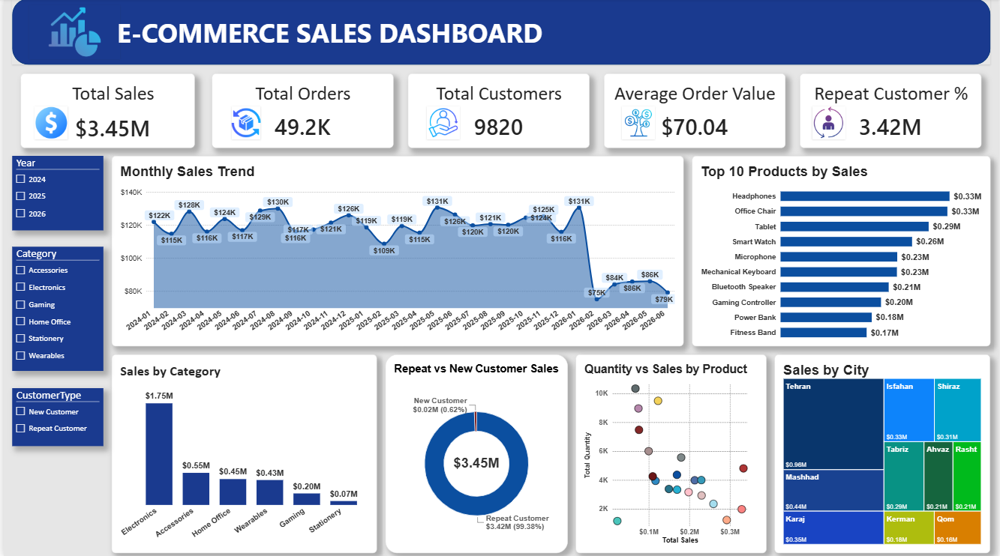

# E-Commerce Sales & Customer Analysis

A data analytics portfolio project analyzing e-commerce sales, customer behavior, product performance, and business trends using **Python, SQL, and Power BI**.

---

## 📊 Project Overview

This project analyzes e-commerce transaction data to identify key business trends and customer behavior.

The analysis focuses on:

* Sales performance
* Customer behavior
* Product performance
* Sales trends over time
* Geographic sales distribution
* Customer type analysis
* Business insights

The project follows a complete data analytics workflow:

**Raw Data → Python Data Cleaning & EDA → SQL Analysis → Power BI Dashboard → Business Insights**

---

## 📊 Dashboard Preview



The interactive Power BI dashboard provides an overview of sales performance, customer behavior, product performance, and geographic sales distribution.

---

## 📌 Key Results

* **Total Sales:** $3.45M
* **Total Orders:** 49,198
* **Total Customers:** 9,820
* **Repeat Customer Sales:** $3.42M (99.38% of total sales)
* **Top Category:** Electronics — $1.75M (50.83% of total sales)
* **Top City:** Tehran — $964K
* **Top 10 Products:** $2.44M (70.71% of total sales)

---

## 🛠️ Tools & Technologies

* **Python** — Pandas, NumPy
* **SQL** — MySQL
* **Power BI** — Data Visualization & Dashboard
* **Excel** — Data Checking and Analysis
* **GitHub** — Portfolio & Project Documentation

---

## 📁 Project Structure

```text
E-Commerce-Sales-Customer-Analysis
│
├── data
│   ├── ecommerce_sales_raw.csv
│   └── E-commerce_Sales_Cleaned.csv
│
├── python
│   └── data_cleaning_eda.ipynb
│
├── sql
│   ├── 01_data_validation.sql
│   ├── 02_sales_analysis.sql
│   ├── 03_customer_analysis.sql
│   └── 04_product_analysis.sql
│
├── powerbi
│   └── ecommerce_dashboard.pbix
│
├── dashboard
│   └── dashboard.png
│
├── insights
│   └── business_insights.md
│
└── README.md
```

---

## 📌 Dataset

The dataset contains **49,198 e-commerce orders** covering the period from **January 2024 to June 2026**.

The cleaned dataset contains **24 columns** used for data analysis and visualization.

### Key Columns

| Column          | Description                |
| --------------- | -------------------------- |
| OrderID         | Unique order identifier    |
| CustomerID      | Customer identifier        |
| OrderDate       | Order date                 |
| ProductID       | Product identifier         |
| Quantity        | Quantity purchased         |
| Discount        | Discount percentage        |
| PaymentMethod   | Payment method             |
| Status          | Order status               |
| Age             | Customer age               |
| City            | Customer city              |
| SignupDate      | Customer registration date |
| CustomerSegment | Customer segment           |
| ProductName     | Product name               |
| Category        | Product category           |
| UnitPrice       | Unit price                 |
| Sales           | Sales amount               |
| OrderValue      | Order value                |
| Year            | Order year                 |
| Month           | Order month                |
| MonthName       | Order month name           |
| Quarter         | Order quarter              |
| YearMonth       | Year and month             |
| OrderCount      | Order count                |
| CustomerType    | New or Repeat Customer     |

---

## 🔍 Data Validation

SQL validation was performed to check data quality and dataset consistency.

| Metric         |              Result |
| -------------- | ------------------: |
| Total Rows     |              49,198 |
| Unique Orders  |              49,198 |
| Duplicate Rows |                   0 |
| NULL Values    |                   0 |
| Date Range     | Jan 2024 – Jun 2026 |
| Total Quantity |              92,660 |
| Total Sales    |              $3.45M |

---

## 📈 Key Business Findings

### 1. Repeat Customers Drive Revenue

Repeat customers generated approximately **$3.42M**, representing **99.38% of total sales**.

| Metric                       |  Result |
| ---------------------------- | ------: |
| Repeat Customers             |   9,500 |
| Repeat Orders                |  48,878 |
| Average Orders per Customer  |    5.15 |
| Average Revenue per Customer | $360.48 |

**Business Implication**

The dataset shows a strong concentration of revenue among repeat customers. Customer retention and repeat-purchase behavior are therefore important areas for further analysis.

---

### 2. Electronics Is the Main Revenue Driver

Electronics generated approximately **$1.75M**, representing **50.83% of total sales**.

Other major categories include:

| Category    |  Sales |
| ----------- | -----: |
| Electronics | $1.75M |
| Accessories |  $553K |
| Home Office |  $446K |
| Wearables   |  $429K |

**Business Implication**

Electronics represents the largest revenue category. Product availability, pricing, and cross-selling opportunities could therefore be areas for further investigation.

---

### 3. Sales Performance Varied Across Years

Annual sales for the available periods were:

| Year  |  Sales |
| ----- | -----: |
| 2024  | $1.46M |
| 2025  | $1.44M |
| 2026* | Jan-Jun only |

2025 sales were approximately **1.07% lower than 2024**.

*The 2026 dataset only covers **January–June**, so it should not be directly compared with the full-year totals for 2024 and 2025.

**Business Implication**

The year-over-year change between 2024 and 2025 was relatively small. Monthly trends should be monitored to identify changes in sales performance and seasonal patterns.

---

### 4. Top Products Contribute a Large Share of Revenue

The **top 10 products generated approximately $2.44M**, representing **70.71% of total sales**.

**Business Implication**

Revenue is concentrated among a relatively small group of products. Monitoring the availability and performance of high-revenue products may be important for maintaining sales performance.

---

### 5. High Sales Volume Does Not Always Mean High Revenue

Examples from the product analysis:

| Product    | Quantity |    Sales |
| ---------- | -------: | -------: |
| Notebook   |   10,334 |  $67,237 |
| Headphones |    4,804 | $333,531 |
| Tablet     |    1,228 | $292,344 |

The product with the highest quantity sold does not necessarily generate the highest revenue.

**Business Implication**

Product performance should be evaluated using multiple metrics, such as **quantity sold, sales revenue, and average selling value**, rather than quantity alone.

---

### 6. Higher Discounts Are Associated With Lower Average Order Value

| Discount | Average Order Value |
| -------: | ------------------: |
|       0% |              $74.83 |
|      30% |              $55.76 |

The analysis shows an **association** between higher discount levels and lower average order value in the analyzed data.

**Note:** This analysis describes an association and does not establish that discounts caused the lower order value.

---

## 📊 Power BI Dashboard

The Power BI dashboard includes:

### KPI Cards

* Total Sales
* Total Orders
* Total Customers
* Average Order Value
* Repeat Customer Sales %

### Visualizations

* Monthly Sales Trend
* Sales by Category
* Top 10 Products by Sales
* Repeat vs New Customer Sales
* Sales by City
* Quantity vs Sales by Product

### Filters

* Year
* Category
* Customer Type

---

## 🧠 Analysis Workflow

### 1. Data Cleaning & EDA — Python

The raw dataset was cleaned and explored using Pandas.

Main tasks included:

* Data type validation
* Missing value checking
* Duplicate checking
* Feature inspection
* Descriptive analysis
* Exploratory data analysis

**File:** [python/data_cleaning_eda.ipynb](python/data_cleaning_eda.ipynb)

---

### 2. Data Validation & Analysis — SQL

MySQL was used to validate the dataset and perform business analysis.

SQL analysis includes:

* Data validation
* Sales analysis
* Customer analysis
* Product analysis

**Files:**

* [sql/01_data_validation.sql](SQL/01_data_validation.sql)
* [sql/02_sales_analysis.sql](SQL/02_sales_analysis.sql)
* [sql/03_customer_analysis.sql](SQL/03_customer_analysis.sql)
* [sql/04_product_analysis.sql](SQL/04_product_analysis.sql)

---

### 3. Data Visualization — Power BI

Power BI was used to create an interactive dashboard for exploring:

* Sales trends
* Product performance
* Customer behavior
* Category performance
* City-level sales

File: [powerbi/ecommerce_dashboard.pbix](Powerbi/ecommerce_dashboard.pbix)

---

### 4. Business Insights

Key findings and business implications were documented separately.

**File:** [insights/business_insights.md](Insights/business_insights.md)

---

## 📚 Skills Demonstrated

* Data Cleaning
* Exploratory Data Analysis (EDA)
* SQL Data Validation
* SQL Business Analysis
* Customer Analysis
* Product Analysis
* Data Visualization
* Dashboard Development
* KPI Development
* Business Insight Generation
* Data Storytelling

---

## 👤 Author

**Chanakan Angyan**

Bachelor of Science in Computer Science

Aspiring **Data Analyst** with an interest in data analysis, business intelligence, and data visualization.

**Skills:** Python | SQL | Excel | Power BI

**GitHub:** https://github.com/Chanakan-Angyan

**LinkedIn:** [linkedin.com/in/chanakan-angyan](https://www.linkedin.com/in/chanakan-angyan-a2596742a/)

